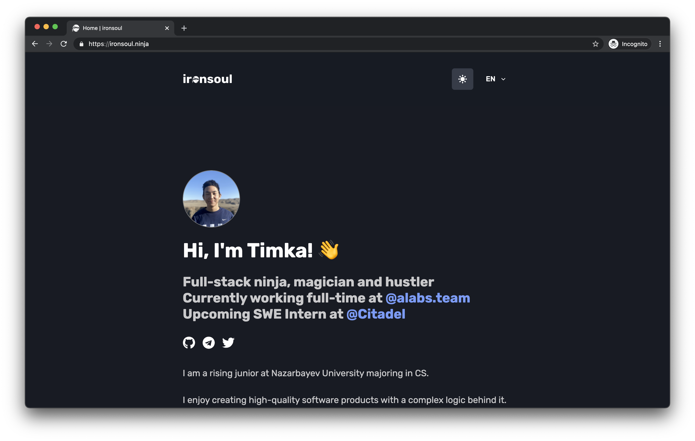

<p align="center">
   Built with <a href="https://www.nextjs.org/" target="_blank">Next.js</a> and hosted with <a href="https://www.vercel.com/" target="_blank">Vercel</a>
</p>



## ✨ Inspiration

This project has been heavily inspired by Tamik. His GitHub repository can be found (here)['https://github.com/ironsoul0/ironsoul.ninja#--ironsoulninja-'].

## 🛠 Wanna run on your machine?

1. Clone the project

   ```sh
   git clone https://github.com/LemonFace0309/personal-website-2.0
   ```

2. Install the dependencies

   ```sh
   cd personal-website-2.0
   npm i
   ```

3. Start the development server

   ```sh
   npm run dev
   ```

## 🚁 Contributing

Feel free to contribute and suggest any improvements.

This repository is a full source of the website created using Next.js, TypeScript and React.

